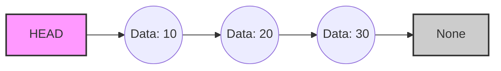
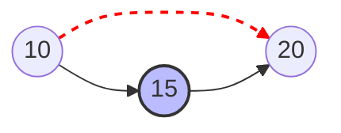
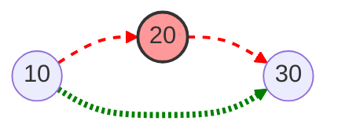

# 🔗 Linked List in Python

## 📘 Concept (English)

A **Linked List** is a linear data structure where elements are not stored at contiguous memory locations. Instead, the elements are linked using pointers.

- **Node**: Each element in a linked list is called a Node. Not contains two parts:
  1.  **Data**: The value stored.
  2.  **Next**: A pointer (reference) to the next node.
- **Head**: The first node of the linked list.

### Why use Linked Lists?

- **Dynamic Size**: Unlike arrays (where size is fixed in some languages), linked lists can grow and shrink dynamically.
- **Efficient Insertion/Deletion**: Insertions and deletions are easier (O(1) if we have the pointer) compared to arrays where we have to shift elements (O(n)).

---

## 📙 Concept (Hinglish)

**Linked List** ek aisi list hai jahan data memory mein ek ke baad ek (contiguous) store nahi hota. Har element (jise hum **Node** kehte hain) apne agle element ka address rakhta hai.

Imagine karo ek "treasure hunt" jahan har parchii (chit) pe agla clue kahan milega, uska address likha hai.

- **Node**: Linked list ka har tukda 'Node' kehlata hai. Iske do hisse hote hain:
  1.  **Data**: Jo value hum store karna chahte hain (jaise 10, 20).
  2.  **Next**: Agle node ka address.
- **Head**: Pehle node ko 'Head' kehte hain. Agar Head kho gaya, toh puri list kho jayegi!

### 🎨 Visual Representation (Diagram)

**1. Basic Structure**



**2. Insertion (Inserting 15 between 10 and 20)**



**3. Deletion (Deleting 20)**



---

## 🛠 Common Operations (Concept)

### 1. Traversal (Ghumna)

- **English**: Visiting every node in the list one by one to check values or print them. We start from Head and move next until we reach `None`.
- **Hinglish**: List ke har ek node par ja kar uska data check karna ya print karna. Hum Head se shuru karte hain aur jab tak Next `None` nahi milta, aage badhte rehte hain.

### 2. Insertion at Position (Beech mein dalna)

- **English**: To insert at index `P`, traversing to index `P-1`. Point the new node to the node currently at `P`, and update `P-1`'s next to point to the new node.
- **Hinglish**: Agar kisi specific jagah (position) par data dalna hai, toh usse **ek pehle** wale node par ruk jao.
  - Example: Position 2 par dalna hai, toh Position 1 wale node ka 'Next' naye node par point kara do.

### 3. Deletion (Hatana)

- **English**: To delete a node at index `P`, traverse to `P-1`. Change `P-1`'s next pointer to skip the `P`th node and point directly to `P+1`.
- **Hinglish**: Kisi node ko hatane ke liye, usse **pichle** node ka connection direct **agle** node se kar do. Beech wala node apne aap list se alag ho jayega (bypass ho jayega).

---

## 💻 Implementation (Singly Linked List)

Check `Revision/linked_list_implementation.py` for the complete code with line-by-line comments.

```python
class Node:
    def __init__(self, data):
        self.data = data
        self.next = None  # Initially, next is None

class LinkedList:
    def __init__(self):
        self.head = None  # Empty list starts with None

    # Insert at End
    def append(self, data):
        new_node = Node(data)
        if not self.head:
            self.head = new_node
            return
        last = self.head
        while last.next:
            last = last.next
        last.next = new_node

    # Print List
    def display(self):
        current = self.head
        while current:
            print(current.data, end=" -> ")
            current = current.next
        print("None")
```

---

## ⏳ Time Complexity Analysis

👉 **[Read Detailed Universal Time Complexity Guide (Hinglish)](TimeComplexity_All.md)**

| Operation          | Best Case | Worst Case |
| :----------------- | :-------- | :--------- |
| **Insert (Start)** | O(1)      | O(1)       |
| **Insert (End)**   | O(n)      | O(n)       |
| **Access/Search**  | O(1)      | O(n)       |

---

## ⚖️ Linked List vs Arrays (Python Lists)

| Feature               | Linked List                  | Array (Python List)               |
| :-------------------- | :--------------------------- | :-------------------------------- |
| **Memory**            | Non-Contiguous (Scattered)   | Contiguous (Continuous block)     |
| **Size**              | Dynamic                      | Dynamic (but resizing is costly)  |
| **Access Time**       | O(n) (Sequential Access)     | O(1) (Random Access via Index)    |
| **Insertion (Start)** | O(1)                         | O(n) (Need to shift all elements) |
| **Insertion (End)**   | O(n) (if no tail pointer)    | O(1) (Amortized)                  |
| **Memory Usage**      | High (Stores data + pointer) | Low (Only data)                   |

### Kab kya use karein?

- **Array (List) use karein** agar aapko kisi bhi element ko index se access karna ho (`arr[5]`).
- **Linked List use karein** agar aapko baar-baar beech mein ya shuru mein data add/remove karna ho.
