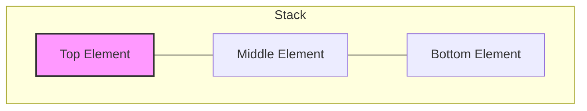

# Stack Data Structure in Python

## Table of Contents

1. [Introduction](#introduction)
2. [Stack Operations](#stack-operations)
3. [Implementation Methods](#implementation-methods)
4. [Time Complexity](#time-complexity)
5. [Applications](#applications)
6. [Common Problems](#common-problems)
7. [Best Practices](#best-practices)

## Introduction

A **Stack** is a linear data structure that follows the **LIFO (Last In First Out)** principle. The last element added to the stack will be the first one to be removed.

Think of it like a stack of plates - you add plates to the top and remove plates from the top.

### Key Characteristics:

- Elements are added and removed from the same end (called the "top")
- Only the top element is accessible at any time
- Insertion and deletion operations are called **push** and **pop**

### Diagram



### Real-world Analogies:

- Stack of books
- Stack of plates
- Browser back button
- Undo/Redo functionality

## Stack Operations

### Basic Operations:

1. **push(item)** - Add an element to the top of the stack

   ```mermaid
   graph TD
      N((New Item)) --> T[Top]
      T --- M[Middle]
      M --- B[Bottom]
      classDef new fill:#bbf,stroke:#333,stroke-width:2px;
      class N new;
   ```

2. **pop()** - Remove and return the top element

   ```mermaid
   graph TD
      T[Top] -.-> O((Output))
      style O fill:#f96,stroke:#333,stroke-width:2px,stroke-dasharray: 5 5;
      subgraph Remaining Stack
      M[Middle] --- B[Bottom]
      end
   ```

3. **peek() / top()** - Return the top element without removing it
4. **isEmpty()** - Check if the stack is empty
5. **size()** - Return the number of elements in the stack
6. **clear()** - Remove all elements from the stack

## Implementation Methods

### Method 1: Using Python List

Python lists can be used as stacks with `append()` as push and `pop()` operations.

```python
# Initialize an empty stack
stack = []

# Push operations
stack.append(10)
stack.append(20)
stack.append(30)
print("Stack after pushes:", stack)  # [10, 20, 30]

# Peek operation
if stack:
    print("Top element:", stack[-1])  # 30

# Pop operation
top = stack.pop()
print("Popped element:", top)  # 30
print("Stack after pop:", stack)  # [10, 20]

# Check if empty
is_empty = len(stack) == 0
print("Is empty:", is_empty)  # False

# Size of stack
size = len(stack)
print("Size:", size)  # 2
```

**Advantages:**

- Simple and easy to use
- Built-in operations

**Disadvantages:**

- `append()` can be slow if resizing is needed
- No size limit enforcement

### Method 2: Using collections.deque

`deque` (double-ended queue) is more efficient than list for stack operations.

```python
from collections import deque

# Initialize stack
stack = deque()

# Push operations
stack.append(10)
stack.append(20)
stack.append(30)
print("Stack:", list(stack))  # [10, 20, 30]

# Peek operation
if stack:
    print("Top element:", stack[-1])  # 30

# Pop operation
top = stack.pop()
print("Popped element:", top)  # 30

# Check if empty
is_empty = len(stack) == 0
print("Is empty:", is_empty)  # False

# Size
size = len(stack)
print("Size:", size)  # 2
```

**Advantages:**

- O(1) time complexity for append and pop
- More memory efficient
- Thread-safe operations

### Method 3: Using queue.LifoQueue

Thread-safe stack implementation from the `queue` module.

```python
from queue import LifoQueue

# Initialize stack with maximum size
stack = LifoQueue(maxsize=3)

# Push operations
stack.put(10)
stack.put(20)
stack.put(30)

# Check if full
print("Is full:", stack.full())  # True

# Pop operation
top = stack.get()
print("Popped element:", top)  # 30

# Check if empty
print("Is empty:", stack.empty())  # False

# Size
print("Size:", stack.qsize())  # 2
```

**Advantages:**

- Thread-safe (useful in multi-threaded applications)
- Built-in size limit

**Disadvantages:**

- Blocking operations (can wait if stack is empty/full)
- Peek operation not directly available

### Method 4: Custom Stack Class

A custom implementation provides more control and additional features.

```python
class Stack:
    def __init__(self, max_size=None):
        """Initialize an empty stack with optional maximum size."""
        self.items = []
        self.max_size = max_size

    def push(self, item):
        """Add an item to the top of the stack."""
        if self.max_size is not None and len(self.items) >= self.max_size:
            raise OverflowError("Stack is full")
        self.items.append(item)

    def pop(self):
        """Remove and return the top item from the stack."""
        if self.is_empty():
            raise IndexError("pop from empty stack")
        return self.items.pop()

    def peek(self):
        """Return the top item without removing it."""
        if self.is_empty():
            raise IndexError("peek from empty stack")
        return self.items[-1]

    def is_empty(self):
        """Check if the stack is empty."""
        return len(self.items) == 0

    def is_full(self):
        """Check if the stack is full."""
        if self.max_size is None:
            return False
        return len(self.items) >= self.max_size

    def size(self):
        """Return the number of items in the stack."""
        return len(self.items)

    def clear(self):
        """Remove all items from the stack."""
        self.items.clear()

    def __str__(self):
        """String representation of the stack."""
        return f"Stack({self.items})"

    def __len__(self):
        """Return the size of the stack."""
        return len(self.items)


# Usage example
stack = Stack(max_size=5)

# Push operations
stack.push(10)
stack.push(20)
stack.push(30)
print(stack)  # Stack([10, 20, 30])

# Peek
print("Top:", stack.peek())  # 30

# Pop
print("Popped:", stack.pop())  # 30
print(stack)  # Stack([10, 20])

# Check status
print("Is empty:", stack.is_empty())  # False
print("Size:", stack.size())  # 2
```

## Time Complexity

| Operation | Time Complexity | Space Complexity |
| --------- | --------------- | ---------------- |
| push()    | O(1)\*          | O(1)             |
| pop()     | O(1)            | O(1)             |
| peek()    | O(1)            | O(1)             |
| isEmpty() | O(1)            | O(1)             |
| size()    | O(1)            | O(1)             |
| search()  | O(n)            | O(1)             |

**Note:** Push operation is O(1) amortized. In rare cases when the underlying list needs to resize, it can be O(n).

### Space Complexity:

- Overall space complexity: **O(n)** where n is the number of elements in the stack

## Applications

### 1. Expression Evaluation

- Infix to Postfix conversion
- Postfix expression evaluation
- Checking balanced parentheses

```python
def is_balanced_parentheses(expression):
    """Check if parentheses in expression are balanced."""
    stack = []
    opening = "({["
    closing = ")}]"
    matches = {')': '(', '}': '{', ']': '['}

    for char in expression:
        if char in opening:
            stack.append(char)
        elif char in closing:
            if not stack or stack[-1] != matches[char]:
                return False
            stack.pop()

    return len(stack) == 0


# Test
print(is_balanced_parentheses("({[]})"))  # True
print(is_balanced_parentheses("({[})"))   # False
print(is_balanced_parentheses("((()))"))  # True
```

### 2. Function Call Management

- Call stack in programming languages
- Recursion implementation
- Backtracking

### 3. Undo/Redo Operations

```python
class TextEditor:
    def __init__(self):
        self.text = ""
        self.undo_stack = []
        self.redo_stack = []

    def write(self, text):
        self.undo_stack.append(self.text)
        self.text += text
        self.redo_stack.clear()  # Clear redo stack on new action

    def undo(self):
        if self.undo_stack:
            self.redo_stack.append(self.text)
            self.text = self.undo_stack.pop()

    def redo(self):
        if self.redo_stack:
            self.undo_stack.append(self.text)
            self.text = self.redo_stack.pop()

    def get_text(self):
        return self.text


# Usage
editor = TextEditor()
editor.write("Hello ")
editor.write("World")
print(editor.get_text())  # "Hello World"
editor.undo()
print(editor.get_text())  # "Hello "
editor.redo()
print(editor.get_text())  # "Hello World"
```

### 4. Browser History

- Back button functionality
- Forward button after going back

### 5. Depth-First Search (DFS)

```python
def dfs_iterative(graph, start):
    """Perform DFS using a stack."""
    visited = set()
    stack = [start]
    result = []

    while stack:
        node = stack.pop()
        if node not in visited:
            visited.add(node)
            result.append(node)
            # Add neighbors in reverse order to maintain left-to-right traversal
            for neighbor in reversed(graph.get(node, [])):
                if neighbor not in visited:
                    stack.append(neighbor)

    return result


# Example graph
graph = {
    'A': ['B', 'C'],
    'B': ['D', 'E'],
    'C': ['F'],
    'D': [],
    'E': ['F'],
    'F': []
}

print(dfs_iterative(graph, 'A'))  # ['A', 'B', 'D', 'E', 'F', 'C']
```

## Common Problems

### 1. Valid Parentheses (LeetCode #20)

```python
def is_valid(s):
    """
    Given a string containing just '(', ')', '{', '}', '[' and ']',
    determine if the input string is valid.
    """
    stack = []
    mapping = {')': '(', '}': '{', ']': '['}

    for char in s:
        if char in mapping:
            top = stack.pop() if stack else '#'
            if mapping[char] != top:
                return False
        else:
            stack.append(char)

    return not stack


print(is_valid("()"))      # True
print(is_valid("()[]{}"))  # True
print(is_valid("(]"))      # False
```

### 2. Min Stack (LeetCode #155)

```python
class MinStack:
    """Stack that supports push, pop, top, and retrieving minimum element in O(1)."""

    def __init__(self):
        self.stack = []
        self.min_stack = []

    def push(self, val):
        self.stack.append(val)
        if not self.min_stack or val <= self.min_stack[-1]:
            self.min_stack.append(val)

    def pop(self):
        if self.stack:
            val = self.stack.pop()
            if val == self.min_stack[-1]:
                self.min_stack.pop()

    def top(self):
        return self.stack[-1] if self.stack else None

    def get_min(self):
        return self.min_stack[-1] if self.min_stack else None


# Usage
min_stack = MinStack()
min_stack.push(-2)
min_stack.push(0)
min_stack.push(-3)
print(min_stack.get_min())  # -3
min_stack.pop()
print(min_stack.top())      # 0
print(min_stack.get_min())  # -2
```

### 3. Evaluate Reverse Polish Notation (LeetCode #150)

```python
def eval_rpn(tokens):
    """Evaluate the value of an arithmetic expression in Reverse Polish Notation."""
    stack = []
    operators = {'+', '-', '*', '/'}

    for token in tokens:
        if token in operators:
            b = stack.pop()
            a = stack.pop()
            if token == '+':
                stack.append(a + b)
            elif token == '-':
                stack.append(a - b)
            elif token == '*':
                stack.append(a * b)
            elif token == '/':
                # Python's division truncates toward negative infinity
                # We need to truncate toward zero
                stack.append(int(a / b))
        else:
            stack.append(int(token))

    return stack[0]


print(eval_rpn(["2", "1", "+", "3", "*"]))  # 9 = (2 + 1) * 3
print(eval_rpn(["4", "13", "5", "/", "+"]))  # 6 = 4 + (13 / 5)
```

### 4. Next Greater Element

```python
def next_greater_elements(nums):
    """Find the next greater element for each element in the array."""
    n = len(nums)
    result = [-1] * n
    stack = []

    for i in range(n):
        while stack and nums[i] > nums[stack[-1]]:
            idx = stack.pop()
            result[idx] = nums[i]
        stack.append(i)

    return result


print(next_greater_elements([4, 5, 2, 10, 8]))  # [5, 10, 10, -1, -1]
print(next_greater_elements([1, 2, 3, 4, 5]))   # [2, 3, 4, 5, -1]
```

### 5. Implement Queue Using Stacks (LeetCode #232)

```python
class MyQueue:
    """Implement a queue using two stacks."""

    def __init__(self):
        self.stack_in = []   # For enqueue operations
        self.stack_out = []  # For dequeue operations

    def push(self, x):
        """Add element to the back of queue."""
        self.stack_in.append(x)

    def pop(self):
        """Remove element from the front of queue."""
        self._move()
        return self.stack_out.pop()

    def peek(self):
        """Get the front element."""
        self._move()
        return self.stack_out[-1]

    def empty(self):
        """Check if queue is empty."""
        return not self.stack_in and not self.stack_out

    def _move(self):
        """Move elements from stack_in to stack_out if needed."""
        if not self.stack_out:
            while self.stack_in:
                self.stack_out.append(self.stack_in.pop())


# Usage
queue = MyQueue()
queue.push(1)
queue.push(2)
print(queue.peek())   # 1
print(queue.pop())    # 1
print(queue.empty())  # False
```

## Best Practices

### 1. Choose the Right Implementation

- Use **list** for simple use cases
- Use **deque** for better performance
- Use **LifoQueue** for thread-safe operations
- Use **custom class** for specific requirements

### 2. Always Check for Empty Stack

```python
# Bad
stack = []
item = stack.pop()  # May raise IndexError

# Good
stack = []
if stack:
    item = stack.pop()
else:
    print("Stack is empty")

# Better (with custom exception handling)
stack = []
try:
    item = stack.pop()
except IndexError:
    print("Cannot pop from empty stack")
```

### 3. Use Meaningful Names

```python
# Bad
s = []
s.append(10)

# Good
call_stack = []
call_stack.append(function_name)
```

### 4. Consider Memory Constraints

```python
# For large stacks, consider maximum size
class BoundedStack:
    def __init__(self, max_size):
        self.stack = []
        self.max_size = max_size

    def push(self, item):
        if len(self.stack) >= self.max_size:
            raise OverflowError("Stack overflow")
        self.stack.append(item)
```

### 5. Use Type Hints (Python 3.5+)

```python
from typing import List, Optional

class Stack:
    def __init__(self) -> None:
        self.items: List[int] = []

    def push(self, item: int) -> None:
        self.items.append(item)

    def pop(self) -> int:
        if self.is_empty():
            raise IndexError("pop from empty stack")
        return self.items.pop()

    def peek(self) -> Optional[int]:
        return self.items[-1] if self.items else None

    def is_empty(self) -> bool:
        return len(self.items) == 0
```

## Summary

### Key Takeaways:

1. Stack follows LIFO principle
2. Main operations: push, pop, peek
3. All basic operations are O(1)
4. Multiple implementation methods available
5. Widely used in recursion, expression evaluation, and backtracking
6. Choose implementation based on requirements (thread-safety, size limits, etc.)

### When to Use Stack:

- ✅ When you need LIFO behavior
- ✅ For reversing sequences
- ✅ For backtracking algorithms
- ✅ For parsing expressions
- ✅ For DFS traversal
- ✅ For implementing undo/redo

### When NOT to Use Stack:

- ❌ When you need random access to elements
- ❌ When you need FIFO behavior (use Queue instead)
- ❌ When you need to access elements in the middle

---

**Related Topics:**

- [Queues](README_Queues.md)
- [Linked Lists](README_LinkedList.md)
- [Recursion and Call Stack](README_Recursion.md)
- [Time Complexity](README_TimeComplexity_Concept.md)
