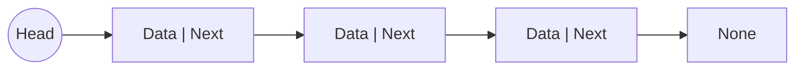
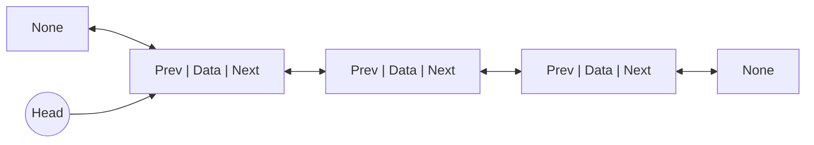
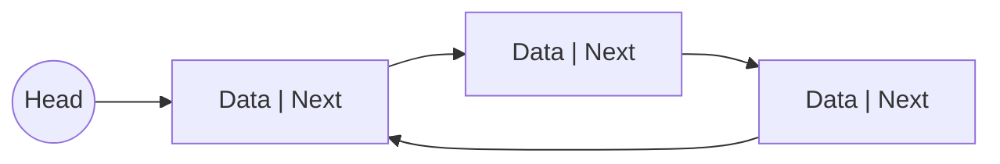
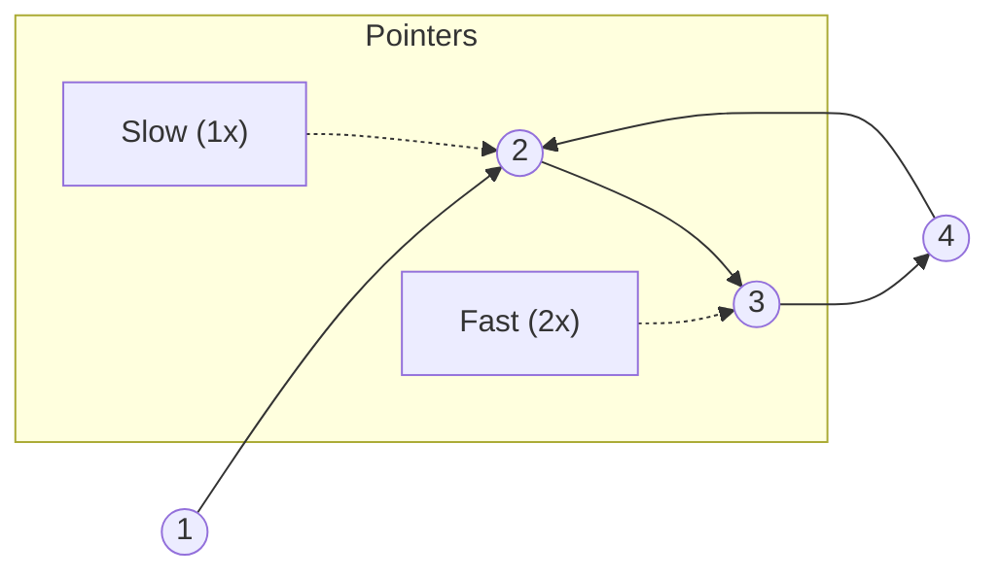

# Linked List Types

A Linked List is a linear data structure where elements are not stored at contiguous memory locations. The elements in a linked list are linked using pointers.

## 1. Singly Linked List

In a Singly Linked List, each node contains:

- **Data**: The value stored in the node.
- **Next**: A pointer (reference) to the next node in the sequence.

**Traversal**: Forward only.
**Memory**: Less memory per node (one pointer).

### Diagram



### Code Example

```python
class Node:
    def __init__(self, data):
        self.data = data
        self.next = None

class SinglyLinkedList:
    def __init__(self):
        self.head = None

    def insert(self, data):
        new_node = Node(data)
        new_node.next = self.head
        self.head = new_node
```

## 2. Doubly Linked List

In a Doubly Linked List, each node contains:

- **Data**: The value stored in the node.
- **Next**: A pointer to the next node.
- **Prev**: A pointer to the previous node.

**Traversal**: Forward and Backward.
**Memory**: More memory per node (two pointers).

### Diagram



### Code Example

```python
class DoublyNode:
    def __init__(self, data):
        self.data = data
        self.next = None
        self.prev = None

class DoublyLinkedList:
    def __init__(self):
        self.head = None

    def insert(self, data):
        new_node = DoublyNode(data)
        new_node.next = self.head
        if self.head:
            self.head.prev = new_node
        self.head = new_node
```

## 3. Circular Linked List

In a Circular Linked List, the **last node points back to the first node instead of `None`**.
It can be singly or doubly circular. (Our implementation is Singly Circular).

**Traversal**: Standard traversal, but needs care to avoid infinite loops.
**Use Cases**: Buffer allocation, round-robin scheduling.

### Diagram



### Code Example

```python
class Node:
    def __init__(self, data):
        self.data = data
        self.next = None

class CircularLinkedList:
    def __init__(self):
        self.head = None

    def insert(self, data):
        new_node = Node(data)
        if not self.head:
            self.head = new_node
            new_node.next = self.head
        else:
            curr = self.head
            while curr.next != self.head:
                curr = curr.next
            curr.next = new_node
            new_node.next = self.head
            self.head = new_node
```

## 4. Fast and Slow Pointer Concept (Tortoise and Hare)

The **Fast and Slow Pointer** technique is a common algorithm used in linked lists. It involves two pointers moving at different speeds.

- **Slow Pointer**: Moves one step at a time.
- **Fast Pointer**: Moves two steps at a time.

### Use Cases

1. **Cycle Detection**: If the Fast Pointer catches up to the Slow Pointer, there is a cycle.
2. **Finding Middle Element**: When the Fast Pointer reaches the end, the Slow Pointer will be at the middle.

### Diagram (Cycle Detection)



### Code Example (Cycle Detection)

```python
def has_cycle(head):
    slow = head
    fast = head
    while fast and fast.next:
        slow = slow.next
        fast = fast.next.next
        if slow == fast:
            return True
    return False
```
